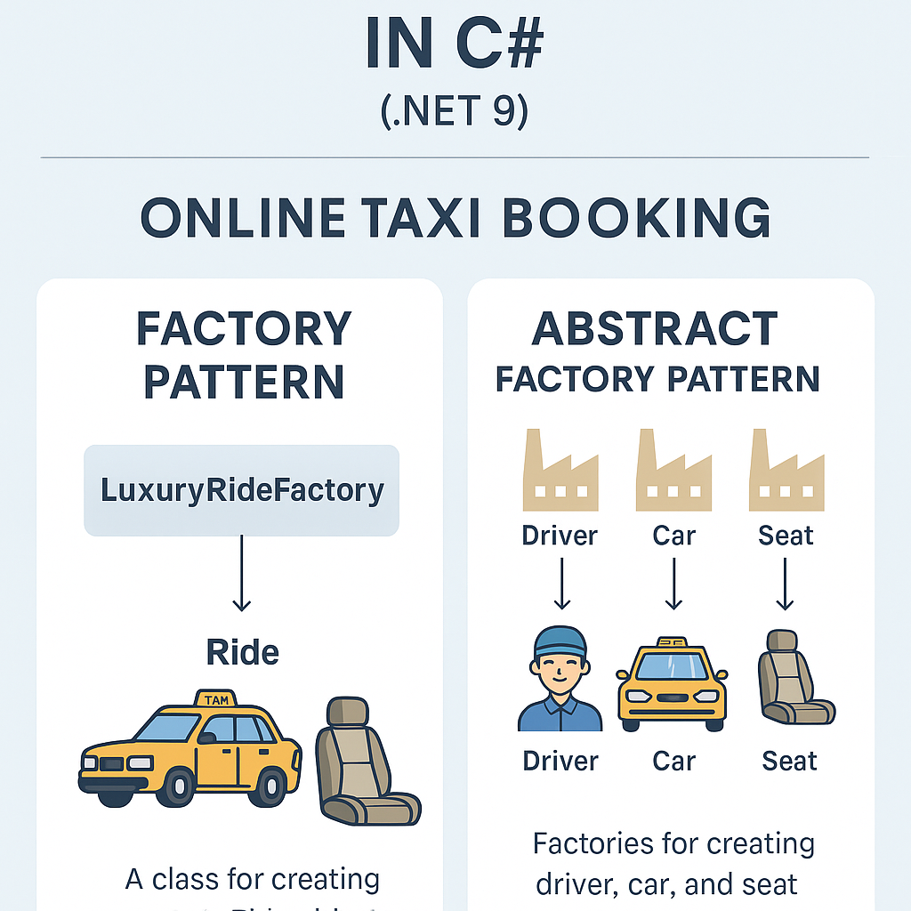

# 🚕 Online Taxi Booking API (C# .NET 9)

This project demonstrates the difference between the **Factory Pattern** and the **Abstract Factory Pattern** using a practical example: a taxi ride booking system supporting multiple service levels: **Economy**, **Business**, and **Luxury**.

## 🧩 Patterns Explained

### 🏭 Factory Pattern
A factory class (e.g., `LuxuryRideFactory`) creates a complete `Ride` object in a single step, depending on the ride type.

### 🧱 Abstract Factory Pattern
Separate component factories (`IRideComponentFactory`) generate **Driver**, **Car**, and **SeatType** individually. These components are then composed into a `Ride`.

## ⚙️ Technologies Used
- C# with .NET 9
- Clean Architecture
- Web API (Controllers, DI, Middleware)
- Swagger UI
- xUnit for unit testing
- Factory and Abstract Factory design patterns

## 🧪 How to Run

### 1. Clone the repo
```bash
git clone https://github.com/saeed371/OnlineTaxiBookingApi.git
cd OnlineTaxiBookingApi
```

### 2. Run the Web API
```bash
dotnet run --project WebApi
```

Then visit: http://localhost:5000

### 3. Run Tests
```bash
dotnet test
```

## 📊 Visual Comparison (Factory vs Abstract Factory)



## ✨ Folder Structure (Clean Architecture)
```
Application/
    Interfaces/
Domain/
    Models/
    Enums/
    ValueObjects/
Infrastructure/
    Factories/
WebApi/
    Controllers/
Tests/
```

## ✅ License
MIT License © 2025
